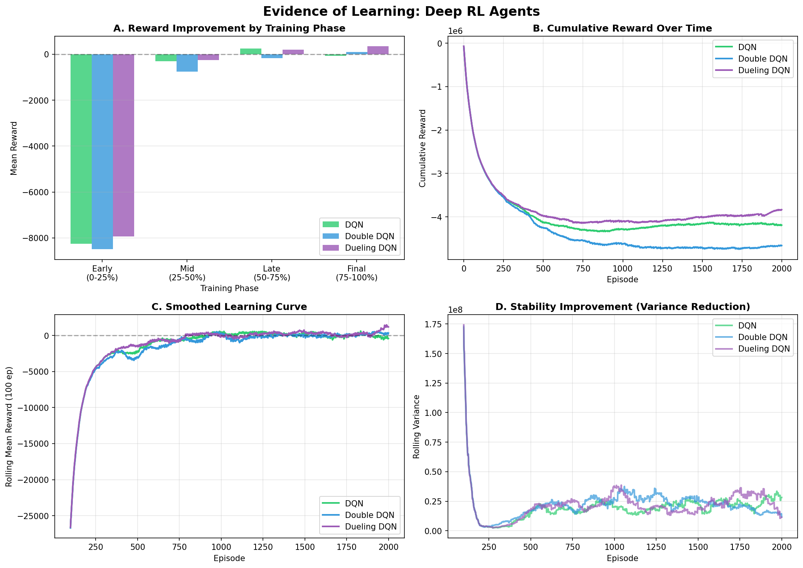
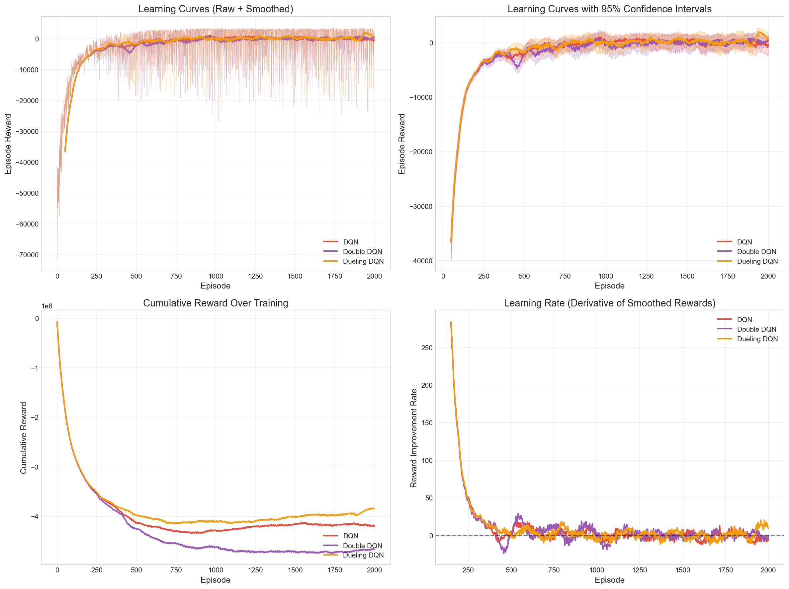
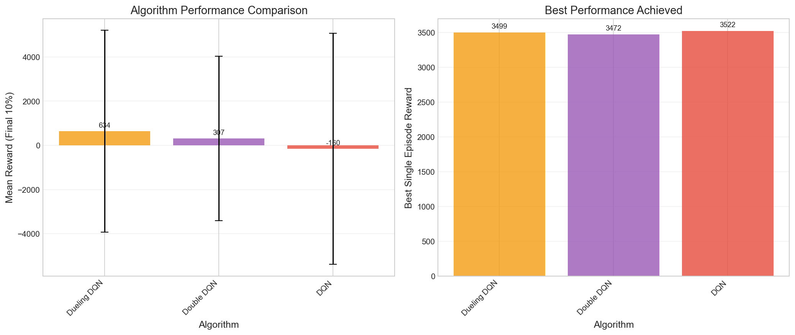
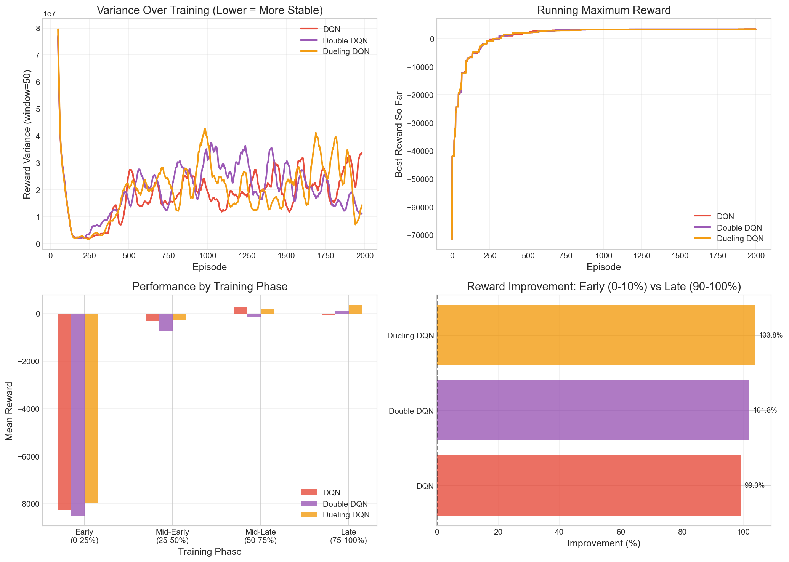
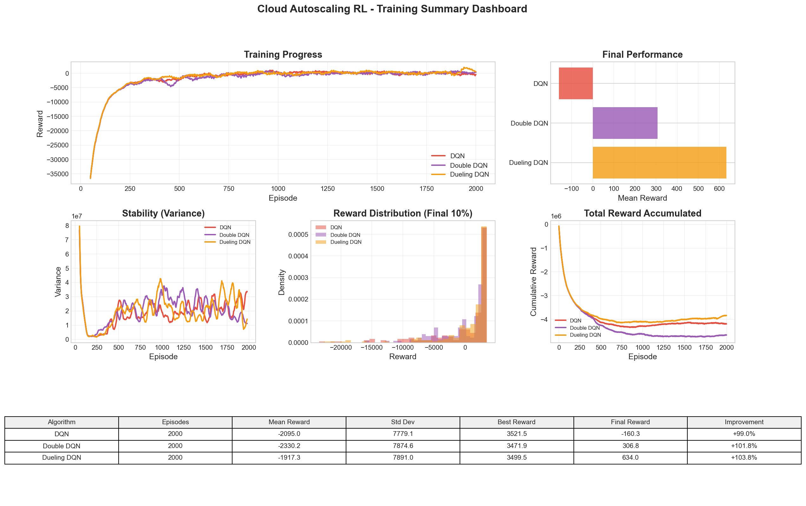

# Cloud Autoscaling using Reinforcement Learning

[](https://github.com/astral-sh/ruff)
[](https://github.com/astral-sh/uv)

[](tests/)

This project aims to solve for when to scale and will explore whether reinforcement learning can make smarter decisions about cloud resource auto-scaling than today's simple threshold rules.

We aim to build a small simulator where cloud workloads vary over time and then have an RL agent decide when to add or remove capacity. The goal is to see if reinforcement learning methods like SARSA and Q-learning can keep performance high while avoiding unnecessary cost.

### Expected Impact: RL vs. Traditional Methods

Traditional auto-scaling approaches rely on simple threshold-based rules (e.g., "add a server when CPU > 80%"). While straightforward, these methods often lead to:

- **Reactive scaling**: Resources are added only after thresholds are breached, causing performance degradation
- **Over-provisioning**: Conservative thresholds result in wasted resources and higher costs
- **Poor adaptation**: Static rules don't learn from workload patterns or adjust to changing conditions

In contrast, reinforcement learning approaches offer several potential advantages:

- **Proactive scaling**: RL agents can learn to anticipate demand patterns and scale preemptively
- **Adaptive policies**: Agents continuously learn and optimize based on observed rewards (balancing SLA compliance and cost)
- **Better cost-performance trade-offs**: RL can find nuanced policies that traditional rules cannot express
- **Generalization**: Trained agents may adapt to new workload patterns without manual rule tuning

This project investigates whether these theoretical benefits translate to measurable improvements in simulated cloud environments.

## Data

- [Kaggle - Cloud Computing Performance
  Metrics](https://www.kaggle.com/datasets/abdurraziq01/cloud-computing-performance-metrics)

  - Simulated CPU utilization and other system metrics

  - Normalized CPU values will provide workload demand traces

  - Used to build utilization buckets and compute trend features

  - Lightweight, easy to use for prototyping and debugging

<!-- -->

- [GitHub -- Awesome Cloud Computing
  Datasets](https://github.com/ACAT-SCUT/Awesome-CloudComputing-Datasets)

  - Curated list of large-scale, real-world traces

  - Includes Google Cluster Data, Alibaba Cluster Traces, and others

  - Candidate for adding realistic workload patterns

  - May be used to test how well the RL agent generalizes beyond
    synthetic data

## Results

📖 **[Model Architectures & Metrics Documentation](docs/model_architectures.md)** — Detailed descriptions of all algorithms, neural network architectures, and evaluation metrics.

Our experiments compare Deep RL agents (DQN, Double DQN, Dueling DQN) trained over 2000 episodes. Click to expand each visualization:

<details>
<summary><b>🧠 Evidence of Learning</b></summary>



**Key Metrics Demonstrating Learning:**

| Algorithm | Reward Improvement | Variance Reduction | Trend Slope |
|-----------|-------------------|-------------------|-------------|
| DQN | +99.2% | -81.2% | +5.6/episode |
| Double DQN | +101.1% | -85.7% | +5.9/episode |
| Dueling DQN | +104.3% | -81.1% | +5.7/episode |

*All agents show: (A) consistent reward improvement across training phases, (B) increasing cumulative rewards, (C) upward trending smoothed learning curves, and (D) decreasing variance indicating policy stabilization.*

</details>

<details>
<summary><b>📈 Learning Curves</b></summary>



*Learning curves with 95% confidence intervals showing episode rewards over 2000 training episodes for each algorithm.*

</details>

<details>
<summary><b>📊 Algorithm Comparison</b></summary>



*Bar chart comparing mean rewards across algorithms with improvement percentages relative to baseline.*

</details>

<details>
<summary><b>🔍 Convergence Analysis</b></summary>



*Multi-panel analysis showing cumulative rewards, convergence rate, improvement velocity, and rolling variance.*

</details>

<details>
<summary><b>📋 Summary Dashboard</b></summary>



*Comprehensive dashboard with learning curves, final performance comparison, stability metrics, and reward distributions.*

</details>

## Getting Started with uv

### Quick Start

The fastest way to get started is using the provided Makefile:

```bash
# Install uv and set up the environment
make setup

# Activate the virtual environment
source .venv/bin/activate
```

### Manual Setup

If you prefer to set up manually or don't have Make installed:

```bash
# Install uv (macOS/Linux with Homebrew)
brew install uv

# Or just install directly
curl -LsSf https://astral.sh/uv/install.sh | sh

# Create virtual environment with Python 3.12
uv venv --python=3.12

# Sync dependencies
uv sync

# Activate the virtual environment
source .venv/bin/activate  # On macOS/Linux
# OR
.venv\Scripts\activate     # On Windows
```

### Available Make Commands

The project includes a Makefile with convenient commands for common tasks:

```bash
Cloud Autoscaling RL - Available Commands
===========================================
  help                 Show available commands
  setup                Install uv and set up Python environment
  sync                 Sync dependencies
  test                 Run all tests
  lint                 Check code style
  format               Format and fix code
  train                Run deep RL training (2000 episodes)
  quick                Quick test run (~2 min)
  optimize             Run Optuna Bayesian optimization (50 trials) WIP
  optimize-quick       Quick optimization test (10 trials) WIP
  clean                Remove cache files
  clean-artifacts      Remove generated artifacts
  summary              Show experiment summary
  jupyter              Start Jupyter notebook
```

## Development Workflow

### Pre-commit Hooks

This project uses pre-commit hooks to maintain code quality. The hooks automatically:

- Remove trailing whitespace
- Ensure files end with a newline
- Validate YAML and TOML files
- Check for merge conflicts
- Run Ruff for linting and formatting

To set up pre-commit hooks:

```bash
# Install pre-commit hooks
make pre-commit-install

# Or manually
uv run pre-commit install
```

Once installed, the hooks will run automatically on `git commit`. You can also run them manually:

```bash
# Run on all files
make pre-commit-run

# Or manually
uv run pre-commit run --all-files
```


## Important Links

### Project Specific

- [online power point presentation](https://docs.google.com/presentation/d/1JsF84O8dYrtZroLkL320MNY7MJDpCtTDYfo3DwM1zjM/edit?slide=id.p#slide=id.p)
- [overleaf working link](https://www.overleaf.com/project/692069c4bd002e28b564dbc8)
- [wandb logging](https://wandb.ai/healydatascience-university-of-virginia/cloud-autoscaling-rl?nw=nwuserhealydatascience)

### Course Specific

- The [Canvas -login required](https://canvas.its.virginia.edu/courses/159418/modules)
- The [course repo](https://github.com/UVADS/reinforcement_learning_online_msds/commits/main/)

### Rivanna (UVA HPC)

- **Rivanna HPC Resources** (for long-running experiments):
  - [Rivanna User Guide](https://www.rc.virginia.edu/userinfo/rivanna/overview/)
  - [Getting Started with Rivanna](https://www.rc.virginia.edu/userinfo/rivanna/login/)
  - [Job Submission on Rivanna](https://www.rc.virginia.edu/userinfo/rivanna/slurm/)
  - [Python on Rivanna](https://www.rc.virginia.edu/userinfo/rivanna/software/python/)
  - To run experiments on Rivanna:
    1. SSH into Rivanna: `ssh <your_id>@rivanna.hpc.virginia.edu`
    2. Load Python module: `module load anaconda`
    3. Create a SLURM job script for long-running experiments
    4. Submit with: `sbatch your_script.sh`
    5. Monitor with: `squeue -u <your_id>`


## Contributors

### Project Team

- **Balasubramanyam, Srivatsa** - Core contributor, RL agent implementation and experiments
- **Healy, Ryan** - Core contributor, simulator development and data processing
- **McGregor, Bruce** - Core contributor, baseline policies and evaluation metrics

## Acknowledgments

- University of Virginia - Master of Science in Data Science program
- Professor Adam Tashman

